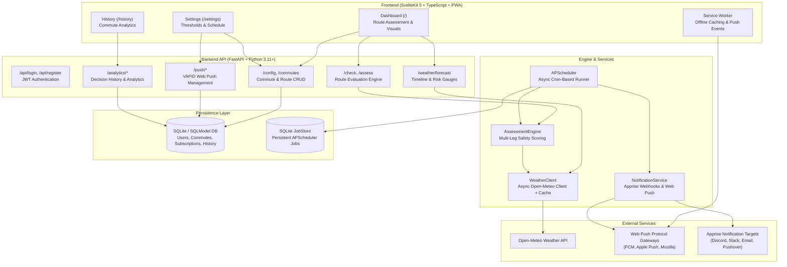

# Commute Check Architecture

## 1. System Overview

**Commute Check** is an automated, weather-based decision engine designed to help motorcyclists and weather-sensitive commuters determine if conditions are safe for riding ("Go"), require caution ("Caution"), or present unsafe hazards ("No-Go").

The application integrates real-time and forecasted meteorological data from the Open-Meteo API, evaluates multi-variable rider safety thresholds, schedules automated evaluations, and delivers multi-channel alerts (Web Push notifications, webhooks via Apprise) and interactive visual dashboards.

---

## 2. Backend Architecture

### 2.1 Technology Stack
- **Runtime**: Python 3.11+
- **Framework**: FastAPI (async ASGI framework)
- **Data Modeling & ORM**: SQLModel (combines Pydantic v2 and SQLAlchemy 2.0)
- **Database**: SQLite (default local file `commute_check.db`, configurable via `DATABASE_URL`)
- **Job Scheduling**: APScheduler 3.x with `SQLAlchemyJobStore` (`jobs.db`)
- **Authentication**: JWT (JSON Web Tokens) with `python-jose` and `passlib`/`bcrypt`
- **Weather Provider**: Open-Meteo API via `httpx` async client with `cachetools` TTL caching
- **Web Push**: VAPID protocol via `pywebpush` and `cryptography`
- **Webhooks**: `apprise` (supporting 80+ notification services)

### 2.2 Core Modules

#### A. Decision Engine (`app/engine.py`)
Evaluates meteorological parameters against user-configured comfort/safety thresholds:
- **Temperature**: Checks minimum temperatures for Caution and No-Go states.
- **Wind Speed & Gusts**: Checks maximum sustained wind and wind gusts against Caution and No-Go cutoffs.
- **Precipitation**: Checks hourly probability of precipitation against maximum acceptable threshold.
- **Multi-Leg Assessment**: Independently scores Outbound (`schedule_time`) and Return (`return_schedule_time`) legs, calculating composite scores and dominant risk factors.

#### B. Weather Client (`app/client.py`)
- Interfaces asynchronously with Open-Meteo forecast endpoints.
- Supports both Metric (°C, km/h) and Imperial (°F, mph) unit systems.
- Caches requests with TTLCache to minimize external API rate consumption and optimize latency.
- Handles dual-coordinate queries for multi-route commute legs concurrently.

#### C. Notification Subsystem (`app/notifications.py`)
- Dispatches formatted assessment summaries to configured Apprise URLs.
- Delivers rich browser notifications to subscribed devices via Web Push Protocol.
- Formats messages with contextual emojis (🏍️ Go, ⚠️ Caution, 🛑 No-Go) and specific weather reasons.

#### D. Persistent Scheduler (`app/main.py`)
- Background `AsyncIOScheduler` dynamically manages cron jobs corresponding to active user commutes.
- Registers independent outbound (`commute_check_{id}_outbound`) and return (`commute_check_{id}_return`) cron jobs when return schedule times are configured.
- Evaluates route weather conditions (origin and destination) ahead of departure times and triggers contextual notification dispatch (specifying leg type and destination).
- Rehydrates and synchronizes jobs on application startup from `Commute` database records.

---

## 3. Frontend Architecture

### 3.1 Technology Stack
- **Framework**: SvelteKit 2 / Svelte 5 (with Runes mode)
- **Language**: TypeScript
- **Styling**: Vanilla CSS with modern custom properties (Dark/Light mode support)
- **Data Visualization**: Chart.js / `svelte-chartjs`
- **PWA**: SvelteKit Service Worker (`src/service-worker.ts`) + Web App Manifest

### 3.2 Key Components & Pages

1. **Dashboard (`src/routes/+page.svelte`)**:
   - Primary commute status display with dynamic color indicators.
   - Dual-leg journey visualizer (Morning Outbound & Evening Return).
   - Hourly weather trend chart (`HourlyWeatherChart.svelte`) with dual Y-axes (temperature/wind and precipitation probability).
   - Real-time risk gauge cards (`RiskGaugeCards.svelte`).
   - Web Push notification toggle and PWA install prompt.

2. **Settings (`src/routes/settings/+page.svelte`)**:
   - Multi-commute management (create, update, delete).
   - Geographic coordinates picker with browser Geolocation fallback.
   - Destination location and return time configuration.
   - Safety thresholds for temperature, wind, and rain.
   - Notification webhook configuration and test dispatcher.

3. **History & Analytics (`src/routes/history/+page.svelte`)**:
   - Daily commute assessment history logs.
   - Riding trends, safety distributions, and historical weather correlation.

4. **Authentication (`src/routes/login/` and `src/routes/register/`)**:
   - Secure token-based session handling stored in client storage with reactive Svelte stores (`$lib/auth.ts`).

---

## 4. Offline Resilience & PWA

- **Service Worker (`service-worker.ts`)**: Pre-caches critical UI shell assets and fonts.
- **Network-First Forecast Caching**: Intercepts `/weather/forecast` requests to allow offline inspection of recent forecast assessments.
- **Offline Banner (`OfflineBanner.svelte`)**: Automatically warns the user when connectivity is lost and displays cached assessment data.
- **Push Notification Listener**: Receives background push messages from OS push services and triggers native browser notification banners even when the tab is closed.

---

## 5. Continuous Integration & Quality Assurance

A GitHub Actions workflow (`.github/workflows/ci.yml`) automatically validates code changes on push and pull requests targeting `main`:
- **Backend Testing**: Executes `pytest tests/` with automatic temporary database teardown and clean-up fixtures.
- **Frontend Testing & Verification**:
  - `npx vitest run`: Executes unit and integration tests across components, routes, and stores.
  - `npm run check`: Runs `svelte-check` with TypeScript type validation.
  - `npm run build`: Verifies successful production build and bundle compilation.
- **Repository Hygiene**: Enforces exclusion of compiled Python bytecode caches (`__pycache__`, `*.pyc`) and temporary SQLite test databases (`test*.db`).
