# Commute Check Architecture (v2.0)

## 1. System Overview

**Commute Check** is an automated, weather-based active safety copilot designed to help motorcyclists and weather-sensitive commuters determine if route conditions are safe for riding ("Go"), require caution ("Caution"), or present unsafe hazards ("No-Go").

Starting in **v2.0**, Commute Check expands beyond terminal point-to-point estimation into comprehensive **Along-the-Route Weather** and **Interactive Waypoint Visualizations**. It integrates real-time and forecasted meteorological data from the Open-Meteo API with driving route geometries from OSRM, evaluates multi-variable rider safety thresholds with time-interpolated segment ETAs, and delivers multi-channel alerts (Web Push notifications, Apprise webhooks) and interactive Leaflet map dashboards.

```mermaid
flowchart TD
    subgraph Client ["Frontend (SvelteKit 5 + TypeScript + Leaflet + PWA)"]
        Dashboard["Dashboard (/)\nRoute Assessment & Interactive Map"]
        RouteMap["RouteMap Component\nColor-Coded Polyline & Hazard Pins"]
        Settings["Settings (/settings)\nThresholds, Waypoints & Schedule"]
        History["History (/history)\nCommute Analytics"]
        SW["Service Worker\nOffline Caching & Push Events"]
    end

    subgraph API ["Backend API (FastAPI + Python 3.11+)"]
        AuthRouter["/api/login, /api/register\nJWT Authentication"]
        CommuteRouter["/config, /commutes\nCommute & Waypoints CRUD"]
        RouteRouter["/api/route/directions\nOSRM Polyline & Step Durations"]
        CheckRouter["/check, /assess\nRoute Evaluation & Hazards Engine"]
        WeatherRouter["/weather/forecast\nTimeline & Risk Gauges"]
        PushRouter["/push/*\nVAPID Web Push Management"]
        AnalyticsRouter["/analytics/*\nDecision History & Analytics"]
    end

    subgraph Core ["Engine & Services"]
        Engine["AssessmentEngine\nAlong-the-Route Time-Interpolated Scoring"]
        RoutingService["RoutingService\nAsync OSRM Client + Haversine Fallback"]
        WClient["WeatherClient\nAsync Open-Meteo Batch Client + Cache"]
        Scheduler["APScheduler\nAsync Cron-Based Runner"]
        NotifService["NotificationService\nMid-Route Hazard Alerts & Webhooks"]
    end

    subgraph Persistence ["Persistence Layer"]
        DB[(SQLite / SQLModel DB\nUsers, Commutes, Waypoints, History)]
        JobsDB[(SQLite JobStore\nPersistent APScheduler Jobs)]
    end

    subgraph External ["External Services"]
        OSRM["OSRM Routing API"]
        OpenMeteo["Open-Meteo Weather API"]
        PushService["Web Push Protocol Gateways\n(FCM, Apple Push, Mozilla)"]
        AppriseTargets["Apprise Notification Targets\n(Discord, Slack, Email, Pushover)"]
    end

    Dashboard --> CommuteRouter
    Dashboard --> CheckRouter
    Dashboard --> RouteRouter
    Dashboard --> WeatherRouter
    Dashboard --> RouteMap
    Settings --> CommuteRouter
    Settings --> PushRouter
    History --> AnalyticsRouter
    SW --> PushService

    CommuteRouter --> DB
    CheckRouter --> Engine
    RouteRouter --> RoutingService
    WeatherRouter --> WClient
    PushRouter --> DB
    AnalyticsRouter --> DB

    Engine --> RoutingService
    Engine --> WClient
    RoutingService --> OSRM
    WClient --> OpenMeteo
    Scheduler --> Engine
    Scheduler --> NotifService

    NotifService --> AppriseTargets
    NotifService --> PushService
    Scheduler --> JobsDB
```

---

## 2. Backend Architecture

### 2.1 Technology Stack
- **Runtime**: Python 3.11+
- **Framework**: FastAPI (async ASGI framework)
- **Data Modeling & ORM**: SQLModel (combines Pydantic v2 and SQLAlchemy 2.0)
- **Database**: SQLite (default local file `commute_check.db`, configurable via `DATABASE_URL`)
- **Routing Engine**: OSRM API client (`app/routing.py`) with haversine linear interpolation fallback
- **Job Scheduling**: APScheduler 3.x with `SQLAlchemyJobStore` (`jobs.db`)
- **Authentication**: JWT (JSON Web Tokens) with `python-jose` and `passlib`/`bcrypt`
- **Weather Provider**: Open-Meteo API via `httpx` async client with `cachetools` TTL caching
- **Web Push**: VAPID protocol via `pywebpush` and `cryptography`
- **Webhooks**: `apprise` (supporting 80+ notification services)

### 2.2 Core Modules

#### A. Routing Service (`app/routing.py`)
- Interfaces asynchronously with the Open Source Routing Machine (OSRM) driving profile.
- Calculates full route polyline geometry (GeoJSON coordinate list `[[lon, lat], ...]`), total distance (meters), total duration (seconds), and leg/step durations between waypoints.
- **Resilience Fallback**: In the event of network timeouts (3.0s threshold) or OSRM unavailability, automatically falls back to great-circle (haversine) distance calculations with an estimated average transit speed (50 km/h) to guarantee continuity.

#### B. Along-the-Route Decision Engine (`app/engine.py`)
Evaluates meteorological parameters across both route terminals and intermediate route segments:
- **Time-Interpolated Sampling**: For a scheduled departure time $T_0$, computes the cumulative estimated arrival time $T_i = T_0 + \Delta t_i$ at each waypoint/intermediate segment, sampling weather conditions at the specific forecast hour.
- **Multi-Variable Threshold Scoring**:
  - **Temperature**: Checks minimum temperatures for Caution and No-Go states.
  - **Wind Speed & Gusts**: Evaluates sustained wind and gusts along exposed route stretches.
  - **Precipitation**: Checks hourly precipitation probability against maximum allowable tolerance.
- **Segment Risk Breakdown**: Provides segment-by-segment evaluations and flags specific **Hazard Pinpoints** (coordinates, time, parameter, severity, and localized note).
- **Composite Scoring**: Calculates overall journey score and sets overall status to the worst segment encountered.

#### C. Weather Client (`app/client.py`)
- Interfaces asynchronously with Open-Meteo forecast endpoints.
- Supports batch concurrent coordinate querying with `cachetools` TTL caching to minimize latency and redundant external API calls.
- Supports both Metric (°C, km/h) and Imperial (°F, mph) unit systems.

#### D. Notification Subsystem (`app/notifications.py`)
- Delivers rich notifications via Web Push and Apprise webhooks.
- Formats contextual mid-route hazard alerts detailing the exact waypoint location and encounter ETA (e.g. `⚠️ Caution: 28 mph wind gusts near Summit Pass at ~08:25 AM`).

#### E. Persistent Scheduler (`app/main.py`)
- Background `AsyncIOScheduler` dynamically manages cron jobs corresponding to active user commutes.
- Evaluates multi-waypoint route weather conditions ahead of departure times and triggers contextual notification dispatch.
- Rehydrates and synchronizes jobs on application startup from `Commute` database records.

---

## 3. Frontend Architecture

### 3.1 Technology Stack
- **Framework**: SvelteKit 2 / Svelte 5 (with Runes mode)
- **Language**: TypeScript
- **Styling**: Vanilla CSS with modern custom properties (Dark/Light mode support)
- **Mapping & Geolocation**: Leaflet (`leaflet` and `@types/leaflet`) with OpenStreetMap tiles
- **Data Visualization**: Chart.js / `svelte-chartjs`
- **PWA**: SvelteKit Service Worker (`src/service-worker.ts`) + Web App Manifest

### 3.2 Key Components & Pages

1. **Dashboard (`src/routes/+page.svelte`)**:
   - Primary commute status display with dynamic color indicators.
   - Dual-leg journey visualizer (Morning Outbound & Evening Return).
   - **Interactive Route Map (`RouteMap.svelte`)**: Interactive Leaflet visualizer rendering color-coded route polylines (Green: Go, Amber: Caution, Red: No-Go), waypoint markers, and clickable hazard pinpoints.
   - Hourly weather trend chart (`HourlyWeatherChart.svelte`) and real-time risk gauge cards (`RiskGaugeCards.svelte`).
   - Push notification controls and PWA installation prompt.

2. **Settings (`src/routes/settings/+page.svelte`)**:
   - Multi-commute management (create, update, delete).
   - **Interactive Waypoint Editor**: Add, reorder (move up/down), and delete intermediate route waypoints with custom labels and coordinate validation.
   - Interactive day-of-week schedule selector with quick presets.
   - Safety thresholds and notification webhook configuration.

3. **History & Analytics (`src/routes/history/+page.svelte`)**:
   - Daily commute assessment history logs, riding trends, and historical weather correlation.

4. **Authentication (`src/routes/login/` and `src/routes/register/`)**:
   - Secure token-based session handling stored in client storage with reactive Svelte stores (`$lib/auth.ts`).

---

## 4. Offline Resilience & PWA

- **Service Worker (`service-worker.ts`)**: Pre-caches critical UI shell assets, fonts, and map marker icons.
- **Network-First Forecast Caching**: Intercepts `/weather/forecast` and route evaluation requests to allow offline inspection of recent forecast assessments.
- **Push Notification Listener**: Receives background push messages from OS push services and triggers native browser notification banners even when the tab is closed, navigating directly to the dashboard route map on click.

---

## 5. Continuous Integration & Quality Assurance

A GitHub Actions workflow (`.github/workflows/ci.yml`) automatically validates code changes on push and pull requests targeting `main`:
- **Backend Testing**: Executes `pytest tests/` (115 tests passing across routing, engine, notifications, push, scheduler, security, and API suites).
- **Frontend Testing & Verification**:
  - `npm test`: Executes 90 unit and integration tests across components, maps, routes, and stores.
  - `npm run check`: Runs `svelte-check` with TypeScript type validation (0 errors, 0 warnings).
  - `npm run build`: Verifies production compilation with `@sveltejs/adapter-node`.
