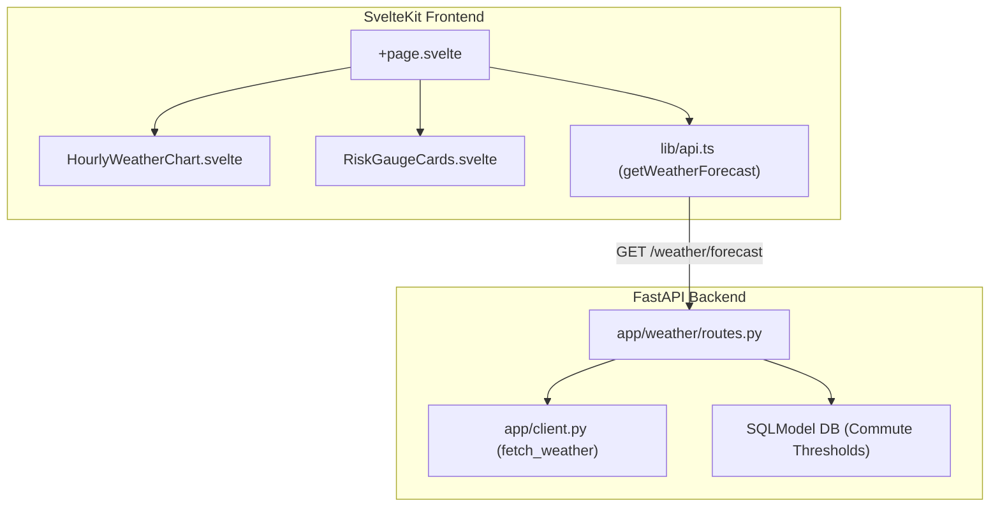

# Phase 13: Weather Visualizations Implementation Plan

> **For agentic workers:** REQUIRED SUB-SKILL: Use superpowers:subagent-driven-development to implement this plan task-by-task. Steps use checkbox (`- [ ]`) syntax for tracking.

**Goal:** Build a comprehensive weather visualization dashboard showing hourly forecast timelines (temperature, wind, precipitation probability) and risk status gauges.

**Architecture:** The FastAPI backend exposes `GET /weather/forecast` combining Open-Meteo hourly data with active commute threshold settings. The SvelteKit frontend renders multi-axis Chart.js timeline charts with threshold overlay lines (`HourlyWeatherChart.svelte`) and risk status gauge cards (`RiskGaugeCards.svelte`).

**Architecture Diagram:**



**Tech Stack:** Python 3.11+, FastAPI, SQLModel, SvelteKit, TypeScript, Chart.js, svelte-chartjs, TailwindCSS.

## Global Constraints
- All backend routes must enforce JWT auth via `get_current_user`.
- Temperatures must support `unit_system` (`metric` vs `imperial`).
- All code must follow true Red-Green-Refactor TDD.

---

### Task 1: Backend Weather Forecast API (`GET /weather/forecast`)

**Files:**
- Create: `app/weather/__init__.py`
- Create: `app/weather/schemas.py`
- Create: `app/weather/routes.py`
- Modify: `app/main.py`
- Test: `tests/test_weather_api.py`

**Interfaces:**
- Consumes: `app.client.fetch_weather`, `app.security.get_current_user`, `app.database.get_session`
- Produces: `GET /weather/forecast` returning `ForecastResponse`

- [ ] **Step 1: Write failing test for `/weather/forecast`**

Create `tests/test_weather_api.py`:
```python
import pytest
from unittest.mock import patch, AsyncMock
from fastapi.testclient import TestClient
from sqlmodel import create_engine, Session, SQLModel
from app.main import app
from app.database import get_session
from app.models import User, Commute
from app.security import ALGORITHM, SECRET_KEY, get_password_hash
from jose import jwt
from datetime import datetime, timedelta, timezone

DATABASE_URL = "sqlite:///./test_weather.db"
engine = create_engine(DATABASE_URL, echo=False)

@pytest.fixture(name="session")
def session_fixture():
    SQLModel.metadata.create_all(engine)
    with Session(engine) as session:
        yield session
    SQLModel.metadata.drop_all(engine)

@pytest.fixture(name="client")
def client_fixture(session: Session):
    app.dependency_overrides[get_session] = lambda: session
    client = TestClient(app)
    yield client
    app.dependency_overrides.clear()

def create_user_and_token(session: Session):
    user = User(email="weather@example.com", hashed_password=get_password_hash("pass"))
    session.add(user)
    session.commit()
    session.refresh(user)
    
    commute = Commute(name="Work", lat=40.7128, lon=-74.0060, schedule_time="08:00", user_id=user.id)
    session.add(commute)
    session.commit()

    token = jwt.encode({"sub": user.email, "exp": datetime.now(timezone.utc) + timedelta(hours=1)}, SECRET_KEY, algorithm=ALGORITHM)
    return user, token

def test_weather_forecast_endpoint(client: TestClient, session: Session):
    user, token = create_user_and_token(session)
    
    with patch("app.client.fetch_weather", new_callable=AsyncMock) as mock_fetch:
        mock_fetch.return_value = {
            "hourly": {
                "time": ["2026-08-02T08:00", "2026-08-02T09:00"],
                "temperature_2m": [70.0, 72.0],
                "apparent_temperature": [71.0, 73.0],
                "wind_speed_10m": [8.0, 10.0],
                "precipitation_probability": [0, 5],
                "weather_code": [0, 0]
            }
        }
        
        response = client.get("/weather/forecast", headers={"Authorization": f"Bearer {token}"})
        assert response.status_code == 200
        data = response.json()
        assert "hourly" in data
        assert "thresholds" in data
        assert len(data["hourly"]) == 2
```

- [ ] **Step 2: Run test to verify it fails**

Run: `.venv/bin/pytest tests/test_weather_api.py`
Expected: FAIL (404 Not Found)

- [ ] **Step 3: Implement schemas and `/weather/forecast` route**

Create `app/weather/schemas.py`:
```python
from pydantic import BaseModel
from typing import List, Optional
from app.models import UnitSystem

class ThresholdsSchema(BaseModel):
    min_temp_caution: float
    min_temp_no_go: float
    max_wind_caution: float
    max_wind_no_go: float
    rain_threshold: float

class HourlyForecastItem(BaseModel):
    time: str
    temperature: float
    apparent_temp: float
    wind_speed: float
    precip_prob: float
    weather_code: int

class ForecastResponse(BaseModel):
    unit_system: UnitSystem
    thresholds: ThresholdsSchema
    hourly: List[HourlyForecastItem]
```

Create `app/weather/routes.py`:
```python
from fastapi import APIRouter, Depends, HTTPException, Query
from sqlmodel import Session, select
from typing import Optional

from app.database import get_session
from app.security import get_current_user
from app.models import User, Commute, UnitSystem
from app.client import fetch_weather
from .schemas import ForecastResponse, ThresholdsSchema, HourlyForecastItem

router = APIRouter(prefix="/weather", tags=["weather"])

@router.get("/forecast", response_model=ForecastResponse)
async def get_weather_forecast(
    commute_id: Optional[int] = None,
    unit_system: UnitSystem = UnitSystem.IMPERIAL,
    current_user: User = Depends(get_current_user),
    db: Session = Depends(get_session)
):
    query = select(Commute).where(Commute.user_id == current_user.id)
    if commute_id:
        query = query.where(Commute.id == commute_id)
    commute = db.exec(query).first()
    
    if not commute:
        raise HTTPException(status_code=404, detail="Commute configuration not found")

    raw_weather = await fetch_weather(commute.lat, commute.lon)
    hourly_raw = raw_weather.get("hourly", {})
    
    times = hourly_raw.get("time", [])
    temps = hourly_raw.get("temperature_2m", [])
    app_temps = hourly_raw.get("apparent_temperature", [])
    winds = hourly_raw.get("wind_speed_10m", [])
    precips = hourly_raw.get("precipitation_probability", [])
    codes = hourly_raw.get("weather_code", [])

    hourly_items = []
    for i in range(min(len(times), 24)):
        hourly_items.append(HourlyForecastItem(
            time=str(times[i]),
            temperature=float(temps[i]) if i < len(temps) else 0.0,
            apparent_temp=float(app_temps[i]) if i < len(app_temps) else 0.0,
            wind_speed=float(winds[i]) if i < len(winds) else 0.0,
            precip_prob=float(precips[i]) if i < len(precips) else 0.0,
            weather_code=int(codes[i]) if i < len(codes) else 0
        ))

    thresholds = ThresholdsSchema(
        min_temp_caution=commute.min_temp_caution,
        min_temp_no_go=commute.min_temp_no_go,
        max_wind_caution=commute.max_wind_caution,
        max_wind_no_go=commute.max_wind_no_go,
        rain_threshold=commute.rain_threshold
    )

    return ForecastResponse(
        unit_system=unit_system,
        thresholds=thresholds,
        hourly=hourly_items
    )
```

Register route in `app/main.py`:
```python
from app.weather.routes import router as weather_router
app.include_router(weather_router)
```

- [ ] **Step 4: Run test to verify it passes**

Run: `.venv/bin/pytest tests/test_weather_api.py`
Expected: PASS

- [ ] **Step 5: Commit**

```bash
git add app/weather/ tests/test_weather_api.py app/main.py
git commit -m "feat(weather): add /weather/forecast endpoint with thresholds"
```

---

### Task 2: Frontend Weather Visualization Components

**Files:**
- Create: `frontend/src/lib/charts/HourlyWeatherChart.svelte`
- Create: `frontend/src/lib/charts/RiskGaugeCards.svelte`
- Modify: `frontend/src/lib/api.ts`

**Interfaces:**
- Consumes: `getWeatherForecast` from `frontend/src/lib/api.ts`
- Produces: `HourlyWeatherChart` and `RiskGaugeCards` SvelteKit components

- [ ] **Step 1: Update frontend API client**

Add `getWeatherForecast` to `frontend/src/lib/api.ts`:
```typescript
export interface ForecastResponse {
  unit_system: string;
  thresholds: {
    min_temp_caution: number;
    min_temp_no_go: number;
    max_wind_caution: number;
    max_wind_no_go: number;
    rain_threshold: number;
  };
  hourly: Array<{
    time: string;
    temperature: number;
    apparent_temp: number;
    wind_speed: number;
    precip_prob: number;
    weather_code: number;
  }>;
}

export async function getWeatherForecast(commuteId?: number, unitSystem: string = 'imperial'): Promise<ForecastResponse> {
  const token = localStorage.getItem('token');
  const params = new URLSearchParams();
  if (commuteId) params.append('commute_id', commuteId.toString());
  params.append('unit_system', unitSystem);

  const res = await fetch(`${API_BASE}/weather/forecast?${params}`, {
    headers: { 'Authorization': `Bearer ${token}` }
  });
  if (!res.ok) throw new Error('Failed to fetch weather forecast');
  return res.json();
}
```

- [ ] **Step 2: Build `RiskGaugeCards.svelte` component**

Create `frontend/src/lib/charts/RiskGaugeCards.svelte`:
```svelte
<script lang="ts">
  const { currentTemp, currentWind, currentPrecip, thresholds, unitSystem = 'imperial' } = $props<{
    currentTemp: number;
    currentWind: number;
    currentPrecip: number;
    thresholds: {
      min_temp_caution: number;
      min_temp_no_go: number;
      max_wind_caution: number;
      max_wind_no_go: number;
      rain_threshold: number;
    };
    unitSystem?: string;
  }>();

  function getTempStatus() {
    if (currentTemp <= thresholds.min_temp_no_go) return { label: 'No-Go', bg: 'bg-red-100 text-red-800' };
    if (currentTemp <= thresholds.min_temp_caution) return { label: 'Caution', bg: 'bg-yellow-100 text-yellow-800' };
    return { label: 'Go', bg: 'bg-green-100 text-green-800' };
  }

  function getWindStatus() {
    if (currentWind >= thresholds.max_wind_no_go) return { label: 'No-Go', bg: 'bg-red-100 text-red-800' };
    if (currentWind >= thresholds.max_wind_caution) return { label: 'Caution', bg: 'bg-yellow-100 text-yellow-800' };
    return { label: 'Go', bg: 'bg-green-100 text-green-800' };
  }

  function getRainStatus() {
    if (currentPrecip >= thresholds.rain_threshold) return { label: 'Caution', bg: 'bg-yellow-100 text-yellow-800' };
    return { label: 'Go', bg: 'bg-green-100 text-green-800' };
  }
</script>

<div class="grid grid-cols-1 md:grid-cols-3 gap-4 my-6">
  <div class="p-4 rounded-xl border border-gray-200 bg-white shadow-sm flex justify-between items-center">
    <div>
      <p class="text-sm font-medium text-gray-500">Temperature</p>
      <p class="text-2xl font-bold text-gray-900">{currentTemp}°{unitSystem === 'imperial' ? 'F' : 'C'}</p>
    </div>
    <span class="px-3 py-1 rounded-full text-xs font-semibold {getTempStatus().bg}">
      {getTempStatus().label}
    </span>
  </div>

  <div class="p-4 rounded-xl border border-gray-200 bg-white shadow-sm flex justify-between items-center">
    <div>
      <p class="text-sm font-medium text-gray-500">Wind Speed</p>
      <p class="text-2xl font-bold text-gray-900">{currentWind} {unitSystem === 'imperial' ? 'mph' : 'km/h'}</p>
    </div>
    <span class="px-3 py-1 rounded-full text-xs font-semibold {getWindStatus().bg}">
      {getWindStatus().label}
    </span>
  </div>

  <div class="p-4 rounded-xl border border-gray-200 bg-white shadow-sm flex justify-between items-center">
    <div>
      <p class="text-sm font-medium text-gray-500">Rain Prob.</p>
      <p class="text-2xl font-bold text-gray-900">{currentPrecip}%</p>
    </div>
    <span class="px-3 py-1 rounded-full text-xs font-semibold {getRainStatus().bg}">
      {getRainStatus().label}
    </span>
  </div>
</div>
```

- [ ] **Step 3: Build `HourlyWeatherChart.svelte` component**

Create `frontend/src/lib/charts/HourlyWeatherChart.svelte`:
```svelte
<script lang="ts">
  import { Line } from 'svelte-chartjs';
  import {
    Chart as ChartJS, Title, Tooltip, Legend, LineElement, LinearScale, CategoryScale, PointElement
  } from 'chart.js';

  ChartJS.register(Title, Tooltip, Legend, LineElement, LinearScale, CategoryScale, PointElement);

  const { hourlyData, thresholds } = $props<{
    hourlyData: Array<{ time: string; temperature: number; wind_speed: number; precip_prob: number }>;
    thresholds: { min_temp_caution: number; max_wind_caution: number };
  }>();

  const labels = hourlyData.map(h => new Date(h.time).toLocaleTimeString([], { hour: '2-digit', minute: '2-digit' }));
  const temps = hourlyData.map(h => h.temperature);
  const winds = hourlyData.map(h => h.wind_speed);

  const chartData = {
    labels,
    datasets: [
      {
        label: 'Temperature',
        data: temps,
        borderColor: '#3b82f6',
        backgroundColor: '#3b82f6',
        yAxisID: 'y'
      },
      {
        label: 'Wind Speed',
        data: winds,
        borderColor: '#f59e0b',
        backgroundColor: '#f59e0b',
        yAxisID: 'y'
      }
    ]
  };

  const chartOptions = {
    responsive: true,
    maintainAspectRatio: false,
    plugins: {
      legend: { position: 'top' as const },
      title: { display: true, text: 'Hourly Weather Forecast' }
    },
    scales: {
      y: { beginAtZero: false, title: { display: true, text: 'Value' } }
    }
  };
</script>

<div class="h-80 w-full p-4 bg-white rounded-xl shadow-sm border border-gray-200">
  <Line data={chartData} options={chartOptions} />
</div>
```

- [ ] **Step 4: Commit**

```bash
git add frontend/src/lib/charts/ frontend/src/lib/api.ts
git commit -m "feat(ui): add HourlyWeatherChart and RiskGaugeCards components"
```

---

### Task 3: Dashboard Page Integration

**Files:**
- Modify: `frontend/src/routes/+page.svelte`

**Interfaces:**
- Consumes: `getWeatherForecast`, `HourlyWeatherChart`, `RiskGaugeCards`

- [ ] **Step 1: Integrate components into `+page.svelte`**

Modify `frontend/src/routes/+page.svelte`:
```svelte
<script lang="ts">
  import { onMount } from 'svelte';
  import RiskGaugeCards from '$lib/charts/RiskGaugeCards.svelte';
  import HourlyWeatherChart from '$lib/charts/HourlyWeatherChart.svelte';
  import { getWeatherForecast, type ForecastResponse } from '$lib/api';

  let forecast = $state<ForecastResponse | null>(null);

  onMount(async () => {
    try {
      forecast = await getWeatherForecast();
    } catch (e) {
      console.error(e);
    }
  });
</script>

{#if forecast && forecast.hourly.length > 0}
  <section class="mt-8">
    <h2 class="text-xl font-bold text-gray-900 mb-4">Weather Visualizations</h2>
    <RiskGaugeCards 
      currentTemp={forecast.hourly[0].temperature}
      currentWind={forecast.hourly[0].wind_speed}
      currentPrecip={forecast.hourly[0].precip_prob}
      thresholds={forecast.thresholds}
      unitSystem={forecast.unit_system}
    />
    <HourlyWeatherChart hourlyData={forecast.hourly} thresholds={forecast.thresholds} />
  </section>
{/if}
```

- [ ] **Step 2: Verify full test suite**

Run: `.venv/bin/pytest`
Expected: ALL PASS

- [ ] **Step 3: Commit**

```bash
git add frontend/src/routes/+page.svelte
git commit -m "feat(dashboard): integrate weather visualization charts & risk gauges"
```
