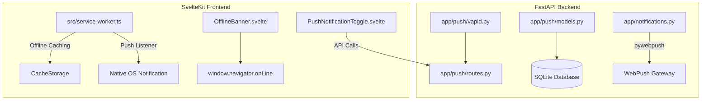

# Phase 14: PWA & Web Push Notifications Implementation Plan

> **For agentic workers:** REQUIRED SUB-SKILL: Use superpowers:subagent-driven-development to implement this plan task-by-task. Steps use checkbox (`- [ ]`) syntax for tracking.

**Goal:** Transform Commute Check into an installable Progressive Web App (PWA) with VAPID-authenticated Web Push Notifications, offline forecast caching, and interactive notification UI controls.

**Architecture:** The backend utilizes `pywebpush` and `cryptography` to generate VAPID keys and manage `PushSubscription` entities linked to users. The frontend uses a SvelteKit Service Worker (`src/service-worker.ts`) to handle push events, display native browser notifications, and cache weather forecast endpoints for offline usage.

**Architecture Diagram:**



**Tech Stack:** Python 3.11+, FastAPI, SQLModel, pywebpush, cryptography, SvelteKit, TypeScript, W3C Push API, Service Worker API.

## Global Constraints

- **Python Version**: Python 3.11+
- **Security**: VAPID P-256 keypairs used for WebPush authorization; JWT Bearer required for `/push/*` endpoints.
- **Testing**: Backend tests in `tests/test_push.py` with 100% mocked `pywebpush`; Frontend unit/component tests in Vitest.
- **PWA Standard**: Web App Manifest (`manifest.webmanifest`) in `frontend/static/`.

---

### Task 1: Backend Dependencies, VAPID Key Generator, and PushSubscription Model

**Files:**
- Modify: [requirements.txt](file:///workspace/commute-check/requirements.txt)
- Create: `app/push/__init__.py`
- Create: [app/push/models.py](file:///workspace/commute-check/app/push/models.py)
- Create: [app/push/vapid.py](file:///workspace/commute-check/app/push/vapid.py)
- Create: [tests/test_push.py](file:///workspace/commute-check/tests/test_push.py)

**Interfaces:**
- Consumes: `app.database.get_session`, `app.models.User`
- Produces: `PushSubscription` SQLModel table, `get_or_create_vapid_keys() -> Tuple[str, str]`

- [ ] **Step 1: Write failing unit test for VAPID key generation and PushSubscription model**

```python
# tests/test_push.py
import pytest
from sqlmodel import Session, SQLModel, create_engine
from app.models import User
from app.push.models import PushSubscription
from app.push.vapid import get_or_create_vapid_keys

def test_vapid_key_generation():
    private_key, public_key = get_or_create_vapid_keys()
    assert private_key is not None
    assert public_key is not None
    assert len(public_key) > 20

def test_push_subscription_model(session: Session):
    user = User(email="pushuser@example.com", hashed_password="hashed_pw")
    session.add(user)
    session.commit()
    session.refresh(user)

    sub = PushSubscription(
        user_id=user.id,
        endpoint="https://fcm.googleapis.com/fcm/send/test_token",
        p256dh="test_p256dh",
        auth="test_auth",
        user_agent="Mozilla/5.0"
    )
    session.add(sub)
    session.commit()
    session.refresh(sub)

    assert sub.id is not None
    assert sub.user_id == user.id
    assert sub.endpoint == "https://fcm.googleapis.com/fcm/send/test_token"
```

- [ ] **Step 2: Run test to verify failure**

Run: `pytest tests/test_push.py -v`
Expected: FAIL with `ModuleNotFoundError: No module named 'app.push'`

- [ ] **Step 3: Add dependencies to requirements.txt and install**

In [requirements.txt](file:///workspace/commute-check/requirements.txt):
```txt
pywebpush>=1.14.0
cryptography>=41.0.0
```

Run: `pip install pywebpush cryptography`

- [ ] **Step 4: Implement PushSubscription model and VAPID key generator**

In [app/push/models.py](file:///workspace/commute-check/app/push/models.py):
```python
from datetime import datetime
from typing import Optional
from sqlmodel import Field, SQLModel

class PushSubscription(SQLModel, table=True):
    id: Optional[int] = Field(default=None, primary_key=True)
    user_id: int = Field(foreign_key="user.id", index=True)
    endpoint: str = Field(unique=True, index=True)
    p256dh: str
    auth: str
    user_agent: Optional[str] = Field(default=None)
    created_at: datetime = Field(default_factory=datetime.utcnow)
```

In [app/push/vapid.py](file:///workspace/commute-check/app/push/vapid.py):
```python
import os
from typing import Tuple
from pywebpush import webpush, WebPushException
from cryptography.hazmat.primitives.asymmetric import ec
from cryptography.hazmat.primitives import serialization
import base64

_VAPID_PRIVATE_KEY: str = os.getenv("VAPID_PRIVATE_KEY", "")
_VAPID_PUBLIC_KEY: str = os.getenv("VAPID_PUBLIC_KEY", "")

def get_or_create_vapid_keys() -> Tuple[str, str]:
    global _VAPID_PRIVATE_KEY, _VAPID_PUBLIC_KEY
    if _VAPID_PRIVATE_KEY and _VAPID_PUBLIC_KEY:
        return _VAPID_PRIVATE_KEY, _VAPID_PUBLIC_KEY

    # Generate EC P-256 keypair for VAPID
    private_key = ec.generate_private_key(ec.SECP256R1())
    private_bytes = private_key.private_bytes(
        encoding=serialization.Encoding.PEM,
        format=serialization.PrivateFormat.PKCS8,
        encryption_algorithm=serialization.NoEncryption()
    )
    public_bytes = private_key.public_key().public_bytes(
        encoding=serialization.Encoding.X509,
        format=serialization.PublicFormat.SubjectPublicKeyInfo
    )

    _VAPID_PRIVATE_KEY = base64.urlsafe_b64encode(private_bytes).decode('utf-8')
    _VAPID_PUBLIC_KEY = base64.urlsafe_b64encode(public_bytes).decode('utf-8')
    return _VAPID_PRIVATE_KEY, _VAPID_PUBLIC_KEY
```

- [ ] **Step 5: Run tests to verify pass**

Run: `pytest tests/test_push.py -v`
Expected: PASS

- [ ] **Step 6: Commit**

```bash
git add requirements.txt app/push/ tests/test_push.py
git commit -m "feat(push): add PushSubscription model and VAPID key generator"
```

---

### Task 2: Backend Web Push API Endpoints and Notification Dispatch Integration

**Files:**
- Create: [app/push/schemas.py](file:///workspace/commute-check/app/push/schemas.py)
- Create: [app/push/routes.py](file:///workspace/commute-check/app/push/routes.py)
- Modify: [app/main.py](file:///workspace/commute-check/app/main.py)
- Modify: [app/notifications.py](file:///workspace/commute-check/app/notifications.py)
- Modify: [tests/test_push.py](file:///workspace/commute-check/tests/test_push.py)

**Interfaces:**
- Consumes: `get_current_user` from `app.security`, `get_session` from `app.database`, `PushSubscription` model
- Produces: `GET /push/vapid-public-key`, `POST /push/subscribe`, `DELETE /push/unsubscribe`, `POST /push/test`, `send_web_push_notifications()` helper

- [ ] **Step 1: Write failing API integration tests**

In [tests/test_push.py](file:///workspace/commute-check/tests/test_push.py):
```python
from unittest.mock import patch
from fastapi.testclient import TestClient

def test_get_vapid_public_key(client: TestClient, auth_headers: dict):
    response = client.get("/push/vapid-public-key", headers=auth_headers)
    assert response.status_code == 200
    data = response.json()
    assert "public_key" in data

def test_subscribe_and_unsubscribe_push(client: TestClient, auth_headers: dict):
    sub_payload = {
        "endpoint": "https://fcm.googleapis.com/fcm/send/unique_token_123",
        "keys": {
            "p256dh": "sample_p256dh_key",
            "auth": "sample_auth_secret"
        }
    }
    # Subscribe
    res_sub = client.post("/push/subscribe", json=sub_payload, headers=auth_headers)
    assert res_sub.status_code == 200
    assert res_sub.json()["status"] == "subscribed"

    # Unsubscribe
    unsub_payload = {"endpoint": "https://fcm.googleapis.com/fcm/send/unique_token_123"}
    res_unsub = client.delete("/push/unsubscribe", json=unsub_payload, headers=auth_headers)
    assert res_unsub.status_code == 200
    assert res_unsub.json()["status"] == "unsubscribed"

@patch("app.push.routes.webpush")
def test_send_test_push(mock_webpush, client: TestClient, auth_headers: dict):
    # Subscribe first
    client.post("/push/subscribe", json={
        "endpoint": "https://fcm.googleapis.com/fcm/send/test_token_456",
        "keys": {"p256dh": "dh", "auth": "au"}
    }, headers=auth_headers)

    res = client.post("/push/test", headers=auth_headers)
    assert res.status_code == 200
    assert res.json()["delivered"] == 1
    assert mock_webpush.called
```

- [ ] **Step 2: Run test to verify failure**

Run: `pytest tests/test_push.py -v`
Expected: FAIL with 404 Not Found for `/push/*` endpoints.

- [ ] **Step 3: Implement Pydantic schemas, FastAPI router, and main app inclusion**

In [app/push/schemas.py](file:///workspace/commute-check/app/push/schemas.py):
```python
from pydantic import BaseModel
from typing import Dict, Optional

class PushKeysSchema(BaseModel):
    p256dh: str
    auth: str

class PushSubscribeRequest(BaseModel):
    endpoint: str
    keys: PushKeysSchema
    user_agent: Optional[str] = None

class PushUnsubscribeRequest(BaseModel):
    endpoint: str

class VapidPublicKeyResponse(BaseModel):
    public_key: str
```

In [app/push/routes.py](file:///workspace/commute-check/app/push/routes.py):
```python
from fastapi import APIRouter, Depends, HTTPException, status
from sqlmodel import Session, select
from typing import List
import json
from pywebpush import webpush, WebPushException

from app.database import get_session
from app.models import User
from app.security import get_current_user
from app.push.models import PushSubscription
from app.push.schemas import (
    PushSubscribeRequest,
    PushUnsubscribeRequest,
    VapidPublicKeyResponse,
)
from app.push.vapid import get_or_create_vapid_keys

router = APIRouter(prefix="/push", tags=["Push Notifications"])

@router.get("/vapid-public-key", response_model=VapidPublicKeyResponse)
def get_vapid_public_key(current_user: User = Depends(get_current_user)):
    _, public_key = get_or_create_vapid_keys()
    return VapidPublicKeyResponse(public_key=public_key)

@router.post("/subscribe")
def subscribe(
    req: PushSubscribeRequest,
    current_user: User = Depends(get_current_user),
    session: Session = Depends(get_session),
):
    existing = session.exec(
        select(PushSubscription).where(PushSubscription.endpoint == req.endpoint)
    ).first()

    if existing:
        existing.user_id = current_user.id
        existing.p256dh = req.keys.p256dh
        existing.auth = req.keys.auth
        existing.user_agent = req.user_agent
        session.add(existing)
    else:
        sub = PushSubscription(
            user_id=current_user.id,
            endpoint=req.endpoint,
            p256dh=req.keys.p256dh,
            auth=req.keys.auth,
            user_agent=req.user_agent,
        )
        session.add(sub)

    session.commit()
    return {"status": "subscribed"}

@router.delete("/unsubscribe")
def unsubscribe(
    req: PushUnsubscribeRequest,
    current_user: User = Depends(get_current_user),
    session: Session = Depends(get_session),
):
    sub = session.exec(
        select(PushSubscription).where(
            PushSubscription.endpoint == req.endpoint,
            PushSubscription.user_id == current_user.id,
        )
    ).first()
    if sub:
        session.delete(sub)
        session.commit()
    return {"status": "unsubscribed"}

@router.post("/test")
def send_test_push(
    current_user: User = Depends(get_current_user),
    session: Session = Depends(get_session),
):
    subs = session.exec(
        select(PushSubscription).where(PushSubscription.user_id == current_user.id)
    ).all()

    if not subs:
        raise HTTPException(status_code=400, detail="No push subscriptions found for user")

    private_key, public_key = get_or_create_vapid_keys()
    payload = json.dumps({
        "title": "Commute Check Test",
        "body": "Web Push Notifications are working perfectly! 🏍️",
        "url": "/dashboard"
    })

    delivered = 0
    failed = 0
    for sub in subs:
        try:
            webpush(
                subscription_info={
                    "endpoint": sub.endpoint,
                    "keys": {"p256dh": sub.p256dh, "auth": sub.auth}
                },
                data=payload,
                vapid_private_key=private_key,
                vapid_claims={"sub": f"mailto:{current_user.email}"}
            )
            delivered += 1
        except WebPushException as ex:
            failed += 1
            if ex.response and ex.response.status_code in (404, 410):
                session.delete(sub)

    session.commit()
    return {"status": "sent", "delivered": delivered, "failed": failed}
```

Include router in [app/main.py](file:///workspace/commute-check/app/main.py):
```python
from app.push.routes import router as push_router
app.include_router(push_router)
```

In [app/notifications.py](file:///workspace/commute-check/app/notifications.py):
Add function `dispatch_web_push_notification(user_id: int, title: str, body: str, session: Session)` that sends WebPush payloads to active user `PushSubscription` entries.

- [ ] **Step 4: Run tests to verify pass**

Run: `pytest tests/test_push.py -v`
Expected: PASS

- [ ] **Step 5: Commit**

```bash
git add app/push/ app/main.py app/notifications.py tests/test_push.py
git commit -m "feat(push): implement web push API routes and notification dispatch"
```

---

### Task 3: SvelteKit PWA Web App Manifest, Service Worker & Offline Caching

**Files:**
- Create: [frontend/static/manifest.webmanifest](file:///workspace/commute-check/frontend/static/manifest.webmanifest)
- Create: `frontend/static/icons/icon-192.png`
- Create: `frontend/static/icons/icon-512.png`
- Modify: [frontend/src/app.html](file:///workspace/commute-check/frontend/src/app.html)
- Create: [frontend/src/service-worker.ts](file:///workspace/commute-check/frontend/src/service-worker.ts)

**Interfaces:**
- Consumes: SvelteKit `$service-worker` build module
- Produces: Service worker caching static assets & `/weather/forecast` API, Web Push listener for `'push'` and `'notificationclick'` events.

- [ ] **Step 1: Create Web App Manifest file and icons**

In [frontend/static/manifest.webmanifest](file:///workspace/commute-check/frontend/static/manifest.webmanifest):
```json
{
  "name": "Commute Check - Rider Weather Safety",
  "short_name": "Commute Check",
  "start_url": "/",
  "display": "standalone",
  "background_color": "#0f172a",
  "theme_color": "#0f172a",
  "orientation": "portrait",
  "icons": [
    {
      "src": "/icons/icon-192.png",
      "sizes": "192x192",
      "type": "image/png"
    },
    {
      "src": "/icons/icon-512.png",
      "sizes": "512x512",
      "type": "image/png"
    }
  ]
}
```

Create placeholder 192x192 and 512x512 PNG icon assets in `frontend/static/icons/`.

Link manifest in [frontend/src/app.html](file:///workspace/commute-check/frontend/src/app.html):
```html
<link rel="manifest" href="/manifest.webmanifest" />
<meta name="theme-color" content="#0f172a" />
```

- [ ] **Step 2: Implement SvelteKit Service Worker (`src/service-worker.ts`)**

In [frontend/src/service-worker.ts](file:///workspace/commute-check/frontend/src/service-worker.ts):
```ts
/// <reference types="@sveltejs/kit" />
import { build, files, version } from '$service-worker';

const CACHE = `cache-${version}`;
const ASSETS = [...build, ...files];

self.addEventListener('install', (event: any) => {
  event.waitUntil(
    caches.open(CACHE).then((cache) => cache.addAll(ASSETS))
  );
});

self.addEventListener('activate', (event: any) => {
  event.waitUntil(
    caches.keys().then(async (keys) => {
      for (const key of keys) {
        if (key !== CACHE) await caches.delete(key);
      }
    })
  );
});

self.addEventListener('fetch', (event: any) => {
  if (event.request.method !== 'GET') return;

  const url = new URL(event.request.url);

  // Cache strategy for weather forecast API: Network first, fallback to cache
  if (url.pathname.includes('/weather/forecast')) {
    event.respondWith(
      fetch(event.request)
        .then((response) => {
          if (response.status === 200) {
            const copy = response.clone();
            caches.open(CACHE).then((cache) => cache.put(event.request, copy));
          }
          return response;
        })
        .catch(() => caches.match(event.request))
    );
    return;
  }

  // Cache-first strategy for app shell assets
  if (ASSETS.includes(url.pathname)) {
    event.respondWith(caches.match(event.request).then(cached => cached || fetch(event.request)));
    return;
  }
});

// Push notification listener
self.addEventListener('push', (event: any) => {
  const data = event.data ? event.data.json() : {};
  const title = data.title || 'Commute Check Update';
  const options = {
    body: data.body || 'Check your commute weather decision.',
    icon: '/icons/icon-192.png',
    badge: '/icons/icon-192.png',
    data: { url: data.url || '/' }
  };
  event.waitUntil((self as any).registration.showNotification(title, options));
});

// Notification click listener
self.addEventListener('notificationclick', (event: any) => {
  event.notification.close();
  const urlToOpen = event.notification.data?.url || '/';
  event.waitUntil(
    (self as any).clients.matchAll({ type: 'window', includeUncontrolled: true }).then((clientList: any[]) => {
      for (const client of clientList) {
        if (client.url === urlToOpen && 'focus' in client) return client.focus();
      }
      if ((self as any).clients.openWindow) return (self as any).clients.openWindow(urlToOpen);
    })
  );
});
```

- [ ] **Step 3: Test frontend build**

Run: `npm --prefix frontend run build`
Expected: Build passes without TypeScript / service-worker errors.

- [ ] **Step 4: Commit**

```bash
git add frontend/static/ frontend/src/app.html frontend/src/service-worker.ts
git commit -m "feat(pwa): add web app manifest, icons, and service worker for push & offline caching"
```

---

### Task 4: Svelte UI Components (PushNotificationToggle, OfflineBanner, PwaInstallPrompt) & Integration

**Files:**
- Create: [frontend/src/lib/components/PushNotificationToggle.svelte](file:///workspace/commute-check/frontend/src/lib/components/PushNotificationToggle.svelte)
- Create: [frontend/src/lib/components/OfflineBanner.svelte](file:///workspace/commute-check/frontend/src/lib/components/OfflineBanner.svelte)
- Create: [frontend/src/lib/components/PwaInstallPrompt.svelte](file:///workspace/commute-check/frontend/src/lib/components/PwaInstallPrompt.svelte)
- Create: [frontend/src/lib/components/__tests__/PushNotificationToggle.test.ts](file:///workspace/commute-check/frontend/src/lib/components/__tests__/PushNotificationToggle.test.ts)
- Modify: [frontend/src/routes/+page.svelte](file:///workspace/commute-check/frontend/src/routes/+page.svelte)

**Interfaces:**
- Consumes: Push API endpoints (`GET /push/vapid-public-key`, `POST /push/subscribe`, `POST /push/test`)
- Produces: Interactive settings UI card, offline status banner, and PWA install trigger.

- [ ] **Step 1: Write Vitest component test for PushNotificationToggle**

In [frontend/src/lib/components/__tests__/PushNotificationToggle.test.ts](file:///workspace/commute-check/frontend/src/lib/components/__tests__/PushNotificationToggle.test.ts):
```ts
import { render, screen } from '@testing-library/svelte';
import { describe, it, expect, vi } from 'vitest';
import PushNotificationToggle from '../PushNotificationToggle.svelte';

describe('PushNotificationToggle', () => {
  it('renders push notification controls', () => {
    render(PushNotificationToggle);
    expect(screen.getByText(/Push Notifications/i)).toBeInTheDocument();
  });
});
```

- [ ] **Step 2: Implement PushNotificationToggle.svelte**

In [frontend/src/lib/components/PushNotificationToggle.svelte](file:///workspace/commute-check/frontend/src/lib/components/PushNotificationToggle.svelte):
```svelte
<script lang="ts">
  import { onMount } from 'svelte';
  import { token } from '$lib/stores/auth';

  let permissionState = 'default';
  let isSubscribed = false;
  let loading = false;
  let message = '';

  onMount(async () => {
    if ('Notification' in window) {
      permissionState = Notification.permission;
    }
    if ('serviceWorker' in navigator) {
      const reg = await navigator.serviceWorker.ready;
      const sub = await reg.pushManager.getSubscription();
      isSubscribed = !!sub;
    }
  });

  function urlBase64ToUint8Array(base64String: string) {
    const padding = '='.repeat((4 - (base64String.length % 4)) % 4);
    const base64 = (base64String + padding).replace(/\-/g, '+').replace(/_/g, '/');
    const rawData = window.atob(base64);
    const outputArray = new Uint8Array(rawData.length);
    for (let i = 0; i < rawData.length; ++i) {
      outputArray[i] = rawData.charCodeAt(i);
    }
    return outputArray;
  }

  async function togglePush() {
    loading = true;
    message = '';
    try {
      if (!isSubscribed) {
        const perm = await Notification.requestPermission();
        permissionState = perm;
        if (perm !== 'granted') {
          message = 'Notification permission denied.';
          loading = false;
          return;
        }

        const vapidRes = await fetch('/api/push/vapid-public-key', {
          headers: { Authorization: `Bearer ${$token}` }
        });
        const { public_key } = await vapidRes.json();

        const reg = await navigator.serviceWorker.ready;
        const sub = await reg.pushManager.subscribe({
          userVisibleOnly: true,
          applicationServerKey: urlBase64ToUint8Array(public_key)
        });

        const subObj = sub.toJSON();
        await fetch('/api/push/subscribe', {
          method: 'POST',
          headers: {
            'Content-Type': 'application/json',
            Authorization: `Bearer ${$token}`
          },
          body: JSON.stringify({
            endpoint: subObj.endpoint,
            keys: {
              p256dh: subObj.keys?.p256dh,
              auth: subObj.keys?.auth
            }
          })
        });

        isSubscribed = true;
        message = 'Web Push notifications enabled!';
      } else {
        const reg = await navigator.serviceWorker.ready;
        const sub = await reg.pushManager.getSubscription();
        if (sub) {
          await fetch('/api/push/unsubscribe', {
            method: 'DELETE',
            headers: {
              'Content-Type': 'application/json',
              Authorization: `Bearer ${$token}`
            },
            body: JSON.stringify({ endpoint: sub.endpoint })
          });
          await sub.unsubscribe();
        }
        isSubscribed = false;
        message = 'Web Push notifications disabled.';
      }
    } catch (err: any) {
      message = err.message || 'Failed to toggle notifications.';
    } finally {
      loading = false;
    }
  }

  async function sendTestPush() {
    loading = true;
    message = '';
    try {
      const res = await fetch('/api/push/test', {
        method: 'POST',
        headers: { Authorization: `Bearer ${$token}` }
      });
      const data = await res.json();
      if (res.ok) {
        message = `Test push dispatched! (${data.delivered} delivered)`;
      } else {
        message = data.detail || 'Test push failed.';
      }
    } catch (err: any) {
      message = 'Failed to dispatch test push.';
    } finally {
      loading = false;
    }
  }
</script>

<div class="bg-slate-800/80 backdrop-blur-md rounded-xl p-5 border border-slate-700/60 shadow-lg text-slate-100">
  <div class="flex items-center justify-between">
    <div>
      <h3 class="text-lg font-semibold flex items-center gap-2">
        🔔 Push Notifications
      </h3>
      <p class="text-sm text-slate-400 mt-1">
        Receive Go/No-Go commute safety alerts directly on your browser or mobile device.
      </p>
    </div>
    <button
      on:click={togglePush}
      disabled={loading}
      class="px-4 py-2 rounded-lg font-medium transition duration-200 text-sm shadow-md flex items-center gap-2
        {isSubscribed ? 'bg-rose-600 hover:bg-rose-500 text-white' : 'bg-emerald-600 hover:bg-emerald-500 text-white'}"
    >
      {isSubscribed ? 'Disable Push' : 'Enable Push'}
    </button>
  </div>

  {#if isSubscribed}
    <div class="mt-4 pt-3 border-t border-slate-700/40 flex items-center justify-between">
      <span class="text-xs text-emerald-400 font-medium flex items-center gap-1">
        ● Subscribed to this device
      </span>
      <button
        on:click={sendTestPush}
        disabled={loading}
        class="px-3 py-1.5 bg-indigo-600 hover:bg-indigo-500 text-xs font-semibold rounded-md text-white transition"
      >
        Send Test Notification
      </button>
    </div>
  {/if}

  {#if message}
    <p class="text-xs mt-3 text-slate-300 bg-slate-900/60 p-2 rounded border border-slate-700">
      {message}
    </p>
  {/if}
</div>
```

- [ ] **Step 3: Implement OfflineBanner.svelte and PwaInstallPrompt.svelte**

In [frontend/src/lib/components/OfflineBanner.svelte](file:///workspace/commute-check/frontend/src/lib/components/OfflineBanner.svelte):
```svelte
<script lang="ts">
  import { onMount } from 'svelte';

  let isOffline = false;

  onMount(() => {
    isOffline = !navigator.onLine;
    const handleOnline = () => (isOffline = false);
    const handleOffline = () => (isOffline = true);

    window.addEventListener('online', handleOnline);
    window.addEventListener('offline', handleOffline);

    return () => {
      window.removeEventListener('online', handleOnline);
      window.removeEventListener('offline', handleOffline);
    };
  });
</script>

{#if isOffline}
  <div class="bg-amber-500/20 border-b border-amber-500/40 text-amber-300 text-xs py-2 px-4 text-center font-medium flex items-center justify-center gap-2">
    <span>⚠️ You are offline. Showing cached weather forecast data.</span>
  </div>
{/if}
```

In [frontend/src/lib/components/PwaInstallPrompt.svelte](file:///workspace/commute-check/frontend/src/lib/components/PwaInstallPrompt.svelte):
```svelte
<script lang="ts">
  import { onMount } from 'svelte';

  let deferredPrompt: any = null;
  let showPrompt = false;

  onMount(() => {
    window.addEventListener('beforeinstallprompt', (e) => {
      e.preventDefault();
      deferredPrompt = e;
      showPrompt = true;
    });
  });

  async function installPwa() {
    if (!deferredPrompt) return;
    deferredPrompt.prompt();
    const { outcome } = await deferredPrompt.userChoice;
    if (outcome === 'accepted') {
      showPrompt = false;
    }
    deferredPrompt = null;
  }
</script>

{#if showPrompt}
  <div class="bg-indigo-600/30 border border-indigo-500/50 p-3 rounded-lg flex items-center justify-between text-slate-100 text-sm mb-4">
    <span>📱 Install Commute Check app on your home screen for quick access.</span>
    <button on:click={installPwa} class="px-3 py-1 bg-indigo-600 hover:bg-indigo-500 text-xs font-semibold rounded text-white transition">
      Install App
    </button>
  </div>
{/if}
```

- [ ] **Step 4: Integrate components into dashboard (`routes/+page.svelte`)**

In [frontend/src/routes/+page.svelte](file:///workspace/commute-check/frontend/src/routes/+page.svelte):
Import and include `<OfflineBanner />`, `<PwaInstallPrompt />`, and `<PushNotificationToggle />`.

- [ ] **Step 5: Run tests to verify pass**

Run: `npm --prefix frontend test` and `pytest`
Expected: ALL backend and frontend tests PASS.

- [ ] **Step 6: Commit**

```bash
git add frontend/src/
git commit -m "feat(ui): integrate PushNotificationToggle, OfflineBanner, and PwaInstallPrompt into dashboard"
```
