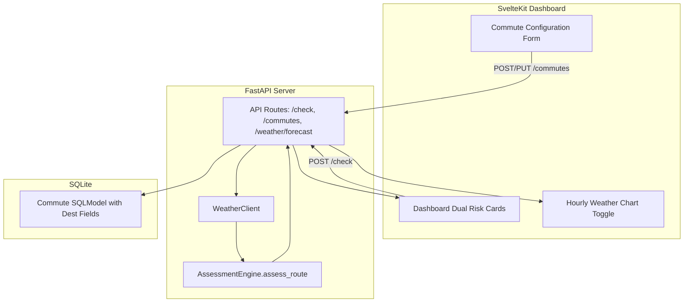

# Phase 15: Multi-Route & Destination Weather Implementation Plan

> **For agentic workers:** REQUIRED SUB-SKILL: Use superpowers:subagent-driven-development to implement this plan task-by-task. Steps use checkbox (`- [ ]`) syntax for tracking.

**Goal:** Add dual-location (origin & destination) weather assessment and morning outbound / evening return split commute scheduling to Commute Check.

**Architecture:** Extend SQLModel `Commute` model with optional destination coordinates and return schedule time. Update `WeatherClient` for parallel multi-point weather fetching, update `AssessmentEngine` to calculate outbound and inbound leg risks, and update SvelteKit UI with destination inputs, leg risk cards, and dual timeline chart toggling.

**Architecture Diagram:**



**Tech Stack:** Python 3.11+, FastAPI, SQLModel, Pydantic, SvelteKit, TypeScript, Chart.js, pytest, Vitest.

## Global Constraints
- Python: 3.14 (Venv: `.venv/bin/pytest`)
- All database changes must maintain backward compatibility for single-location commutes
- TDD required: Write failing tests before implementation code for each task

---

### Task 1: Extend SQLModel Schema & Assessment Models

**Files:**
- Modify: `app/models.py:38-51`
- Test: `tests/test_database.py`

**Interfaces:**
- Consumes: Existing `CommuteBase`, `Commute` models
- Produces: Updated `CommuteBase` with `dest_name`, `dest_lat`, `dest_lon`, `return_schedule_time` + `LegAssessment`, `RouteAssessmentResult` models

- [ ] **Step 1: Write failing test for updated schema**

```python
# In tests/test_database.py
def test_commute_destination_fields(session):
    commute = Commute(
        name="Work Commute",
        lat=37.7749,
        lon=-122.4194,
        dest_name="Office",
        dest_lat=37.3861,
        dest_lon=-122.0839,
        schedule_time="08:00",
        return_schedule_time="17:00"
    )
    session.add(commute)
    session.commit()
    session.refresh(commute)
    assert commute.dest_name == "Office"
    assert commute.return_schedule_time == "17:00"
```

- [ ] **Step 2: Run test to verify it fails**

Run: `.venv/bin/pytest tests/test_database.py::test_commute_destination_fields -v`
Expected: FAIL with AttributeError or extra field error.

- [ ] **Step 3: Update `app/models.py`**

Add destination fields to `CommuteBase` and add `LegAssessment` and `RouteAssessmentResult` schemas.

- [ ] **Step 4: Run test to verify it passes**

Run: `.venv/bin/pytest tests/test_database.py::test_commute_destination_fields -v`
Expected: PASS

- [ ] **Step 5: Commit Task 1**

```bash
git add app/models.py tests/test_database.py
git commit -m "feat(schema): extend Commute model with destination fields and leg assessment schemas"
```

---

### Task 2: Implement Assessment Engine Multi-Point & Return Leg Logic

**Files:**
- Modify: `app/engine.py:3-80`
- Test: `tests/test_engine.py`

**Interfaces:**
- Consumes: `HourlyWeather`, `Commute`, `LegAssessment`, `RouteAssessmentResult`
- Produces: `AssessmentEngine.assess_route(...)`

- [ ] **Step 1: Write failing test for multi-point route assessment**

```python
# In tests/test_engine.py
def test_assess_route_with_destination_and_return():
    engine = AssessmentEngine()
    commute = Commute(
        lat=37.7, lon=-122.4,
        dest_name="Work", dest_lat=37.3, dest_lon=-122.0,
        schedule_time="08:00", return_schedule_time="17:00"
    )
    # Origin weather (good)
    origin_weather = HourlyWeather(temperature=60, apparent_temp=58, wind_speed=5, wind_gusts=8, precip_prob=0, weather_code=0)
    # Dest weather (bad wind)
    dest_weather = HourlyWeather(temperature=60, apparent_temp=58, wind_speed=30, wind_gusts=35, precip_prob=0, weather_code=0)

    result = engine.assess_route(origin_weather, dest_weather, origin_weather, origin_weather, commute)
    assert result.overall_status == Status.NO_GO
    assert result.outbound_leg.status == Status.NO_GO
```

- [ ] **Step 2: Run test to verify it fails**

Run: `.venv/bin/pytest tests/test_engine.py::test_assess_route_with_destination_and_return -v`
Expected: FAIL with AttributeError (`assess_route` missing).

- [ ] **Step 3: Implement `assess_route` in `app/engine.py`**

Implement `assess_route` taking origin/destination weather at departure and return times, scoring outbound and return legs, and compiling `RouteAssessmentResult`.

- [ ] **Step 4: Run test to verify it passes**

Run: `.venv/bin/pytest tests/test_engine.py -v`
Expected: PASS

- [ ] **Step 5: Commit Task 2**

```bash
git add app/engine.py tests/test_engine.py
git commit -m "feat(engine): implement multi-point and outbound/return leg assessment logic"
```

---

### Task 3: Update API Endpoints & Weather Client

**Files:**
- Modify: `app/client.py`
- Modify: `app/weather/routes.py`
- Test: `tests/test_api.py`
- Test: `tests/test_weather_api.py`

**Interfaces:**
- Consumes: Updated `AssessmentEngine` and `WeatherClient`
- Produces: API endpoints supporting `dest_lat`, `dest_lon`, dual location forecast data, and leg assessments.

- [ ] **Step 1: Write failing API test for dual location weather forecast**

```python
# In tests/test_weather_api.py
def test_get_forecast_with_destination(client):
    response = client.get("/weather/forecast?lat=37.7749&lon=-122.4194&dest_lat=37.3861&dest_lon=-122.0839")
    assert response.status_code == 200
    data = response.json()
    assert "destination_hourly" in data
```

- [ ] **Step 2: Run test to verify it fails**

Run: `.venv/bin/pytest tests/test_weather_api.py::test_get_forecast_with_destination -v`
Expected: FAIL

- [ ] **Step 3: Update `WeatherClient` & `app/weather/routes.py`**

Fetch both origin and destination forecasts in `WeatherClient` when destination coordinates are provided, returning structured forecast payload.

- [ ] **Step 4: Run tests to verify pass**

Run: `.venv/bin/pytest tests/test_weather_api.py tests/test_api.py -v`
Expected: PASS

- [ ] **Step 5: Commit Task 3**

```bash
git add app/client.py app/weather/routes.py tests/test_weather_api.py tests/test_api.py
git commit -m "feat(api): add destination weather forecast fetching and route check endpoint updates"
```

---

### Task 4: Frontend UI Updates for Multi-Route & Leg Comparison

**Files:**
- Modify: `frontend/src/routes/+page.svelte`
- Create/Modify: `frontend/src/lib/components/LegRiskCard.svelte`
- Modify: `frontend/src/lib/charts/HourlyWeatherChart.svelte`
- Test: `frontend/src/routes/page.test.ts`

**Interfaces:**
- Consumes: `RouteAssessmentResult` and dual forecast API response
- Produces: Leg comparison UI cards, destination configuration fields, and location toggle in timeline chart.

- [ ] **Step 1: Write failing frontend unit test for LegRiskCard component**

Create `frontend/src/lib/components/__tests__/LegRiskCard.test.ts` verifying rendering of Outbound vs Return leg scores and reasons.

- [ ] **Step 2: Run frontend test to verify failure**

Run: `npm --prefix frontend test`
Expected: FAIL

- [ ] **Step 3: Implement `LegRiskCard.svelte` and integrate into SvelteKit dashboard**

- [ ] **Step 4: Run frontend tests to verify pass**

Run: `npm --prefix frontend test`
Expected: PASS

- [ ] **Step 5: Commit Task 4**

```bash
git add frontend/
git commit -m "feat(frontend): add destination input fields, leg risk comparison cards, and timeline location toggle"
```
