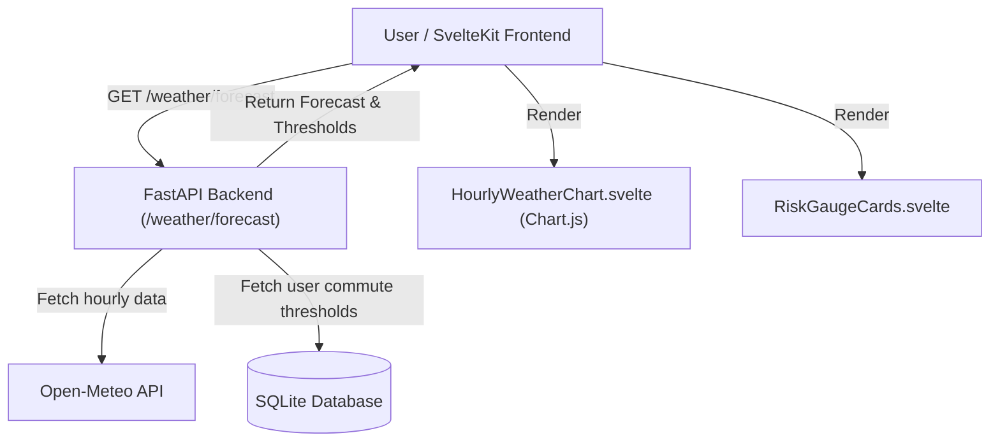

# Design Specification: Phase 13 - Weather Visualizations

## 1. Overview & Vision
Phase 13 introduces rich, interactive weather visualizations to the **Commute Check** dashboard. Riders can inspect hourly weather trends (temperature, wind speed, precipitation probability) alongside their personalized risk thresholds and real-time status gauges (Go / Caution / No-Go).

---

## 2. Architecture & Data Flow



---

## 3. Data Models & API Contracts

### Backend API Endpoint
`GET /weather/forecast`
* **Query Parameters**:
  * `commute_id` (optional `int`): ID of commute configuration (defaults to user's active commute).
  * `unit_system` (optional `str`): `"metric"` or `"imperial"` (default: `"imperial"`).

* **Response Body (`ForecastResponse`)**:
```json
{
  "unit_system": "imperial",
  "thresholds": {
    "min_temp_caution": 45.0,
    "min_temp_no_go": 38.0,
    "max_wind_caution": 15.0,
    "max_wind_no_go": 25.0,
    "rain_threshold": 30.0
  },
  "hourly": [
    {
      "time": "2026-08-02T08:00:00Z",
      "temperature": 68.5,
      "apparent_temp": 70.0,
      "wind_speed": 8.2,
      "precip_prob": 10.0,
      "weather_code": 0
    }
  ]
}
```

---

## 4. Frontend Components

1. **`HourlyWeatherChart.svelte`**:
   * Uses `svelte-chartjs` / `chart.js`.
   * Dual Y-axes: Left Y-axis for Temperature (°F/°C) & Wind Speed (mph/km/h); Right Y-axis for Rain Probability (0-100%).
   * Threshold Overlay Lines: Horizontal dashed threshold indicator lines for Temperature (Caution/No-Go limits) and Wind Speed.

2. **`RiskGaugeCards.svelte`**:
   * Visual status gauge cards for Temperature, Wind, and Rain.
   * Color coded badge styling:
     * 🟢 **Go**: Weather within safe riding limit.
     * 🟡 **Caution**: Nearing tolerance threshold.
     * 🔴 **No-Go**: Exceeds risk threshold limit.

3. **Dashboard Integration (`+page.svelte`)**:
   * Displays the Weather Visualizations block below the primary Go/No-Go decision card.

---

## 5. Testing & Verification Strategy

1. **Backend Tests (`tests/test_weather_api.py`)**:
   * Unit tests for `/weather/forecast` endpoint checking unit conversions (C/F), mock Open-Meteo responses, and auth protection.
2. **Frontend Tests (`frontend/src/lib/charts/HourlyWeatherChart.test.ts`)**:
   * Component render tests ensuring Chart.js receives correct data structures and threshold lines.
