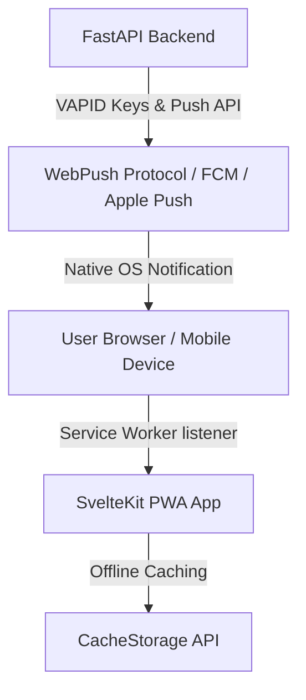

# Phase 14 Design Spec: PWA & Web Push Notifications

**Date:** 2026-08-03  
**Status:** Approved by User  
**Milestone:** v1.3 - PWA & Web Push Notifications  

---

## 1. Overview & Objectives

Phase 14 transforms **Commute Check** into an installable Progressive Web App (PWA) with native browser Web Push Notifications. 

### Key Goals
1. **Native Browser Web Push Notifications**: Users can receive real-time Go/No-Go commute decisions directly on mobile and desktop browsers via VAPID-authenticated Web Push API (without requiring 3rd-party services like Slack or Pushover).
2. **Installable PWA**: Modern Web App Manifest (`manifest.webmanifest`) enabling "Add to Home Screen" capability on iOS, Android, and Desktop.
3. **Offline Resilience**: A SvelteKit Service Worker (`src/service-worker.ts`) that caches static assets and weather forecast responses (`/weather/forecast`), allowing users to inspect their last evaluated commute forecast even when disconnected.
4. **Settings & Controls UI**: Interactive notification toggle, test push generator, and offline status indicator banner.

---

## 2. Architecture & Components



### 2.1 Dependencies
- **Backend**: `pywebpush` (for VAPID encryption & webpush protocol payload delivery), `cryptography` (dependency for VAPID).
- **Frontend**: Native W3C Push API, Service Worker API (`@sveltejs/kit` built-in service worker integration).

---

## 3. Database Schema (`PushSubscription`)

A new SQLModel entity `PushSubscription` will store browser push endpoints and cryptographic keys associated with registered users.

```python
class PushSubscription(SQLModel, table=True):
    id: Optional[int] = Field(default=None, primary_key=True)
    user_id: int = Field(foreign_key="user.id", index=True)
    endpoint: str = Field(unique=True, index=True)
    p256dh: str  # User public key for VAPID payload encryption
    auth: str    # Authentication secret for VAPID payload encryption
    user_agent: Optional[str] = Field(default=None)
    created_at: datetime = Field(default_factory=datetime.utcnow)
```

---

## 4. Backend API Specifications (`app/push/`)

### Endpoints:
1. **`GET /push/vapid-public-key`**
   - **Auth Required**: Yes (JWT Bearer)
   - **Response**: `{ "public_key": "<VAPID_PUBLIC_KEY_BASE64>" }`
   - **Logic**: Returns application server's VAPID public key. Generates and persists VAPID keypair in environment / runtime if missing.

2. **`POST /push/subscribe`**
   - **Auth Required**: Yes (JWT Bearer)
   - **Body**: `{ "endpoint": "https://...", "keys": { "p256dh": "...", "auth": "..." } }`
   - **Response**: `{ "status": "subscribed", "id": 1 }`
   - **Logic**: Upserts `PushSubscription` for the current user.

3. **`DELETE /push/unsubscribe`**
   - **Auth Required**: Yes (JWT Bearer)
   - **Body**: `{ "endpoint": "https://..." }`
   - **Response**: `{ "status": "unsubscribed" }`
   - **Logic**: Deletes specified subscription for the user.

4. **`POST /push/test`**
   - **Auth Required**: Yes (JWT Bearer)
   - **Response**: `{ "status": "sent", "delivered": 1, "failed": 0 }`
   - **Logic**: Dispatches a test push notification to all active push subscriptions for the current user using `pywebpush`.

### Notification Dispatch Integration (`app/notifications.py`):
- Extend `send_commute_notification(user_id, assessment_result)` to check active `PushSubscription` records for `user_id`.
- Dispatch WebPush payloads with title `"Commute Check: {status}"`, body `"Recommendation: {recommendation_reason}"`, and payload data `{ "url": "/dashboard" }`.

---

## 5. Frontend & PWA Integration

### 5.1 Web App Manifest (`static/manifest.webmanifest`)
- `name`: "Commute Check - Rider Weather Safety"
- `short_name`: "Commute Check"
- `start_url`: "/"
- `display`: "standalone"
- `theme_color`: "#0f172a"
- `background_color`: "#0f172a"
- `icons`: 192x192 and 512x512 PNG assets generated and placed in `static/icons/`.

### 5.2 Service Worker (`src/service-worker.ts`)
- **Asset Caching**: Cache app shell, CSS, JS, and `/weather/forecast` API responses with network-first / cache-fallback strategy.
- **Push Event Listener**:
  ```ts
  self.addEventListener('push', (event) => {
    const data = event.data ? event.data.json() : {};
    const title = data.title || 'Commute Check Update';
    const options = {
      body: data.body || 'Check your commute safety status.',
      icon: '/icons/icon-192.png',
      badge: '/icons/icon-192.png',
      data: { url: data.url || '/' }
    };
    event.waitUntil(self.registration.showNotification(title, options));
  });
  ```
- **Notification Click Handler**: Opens or focuses the app window to the payload URL when user clicks notification.

### 5.3 Svelte Components & UX
1. **`PushNotificationToggle.svelte`**:
   - Displays browser push permission status (Granted / Denied / Default).
   - "Enable Push Notifications" toggle: Requests `Notification.requestPermission()`, registers Service Worker subscription, and calls `POST /push/subscribe`.
   - "Send Test Push" button calling `POST /push/test`.
2. **`OfflineBanner.svelte`**:
   - Listens to `window.ononline` and `window.onoffline`.
   - Displays a clean amber badge when operating offline, indicating weather data is served from local cache.
3. **`PwaInstallPrompt.svelte`**:
   - Listens to `beforeinstallprompt` event.
   - Shows a subtle banner enabling 1-click "Install Commute Check App".

---

## 6. Testing & Verification Strategy

1. **Backend Unit & API Tests (`tests/test_push.py`)**:
   - Test VAPID public key retrieval (`GET /push/vapid-public-key`).
   - Test `PushSubscription` creation, deduplication, and removal (`/push/subscribe`, `/push/unsubscribe`).
   - Mock `pywebpush.webpush` to test `/push/test` and notification dispatch logic without external HTTP calls.
2. **Frontend Component & Integration Tests**:
   - Vitest component tests for `PushNotificationToggle.svelte` (permission states, subscribe API calls).
   - Vitest tests for `OfflineBanner.svelte` (online/offline window event reaction).
3. **End-to-End Verification**:
   - Run full pytest test suite (target: all existing 47 + new push tests pass cleanly).
   - Run frontend tests (target: all passing).

---

## 7. Security & Privacy
- VAPID keys generated securely using standard Elliptic Curve P-256 (`cryptography`).
- `PushSubscription` endpoints isolated by user (`user_id` foreign key and JWT authorization required).
- Dead or expired subscription endpoints (HTTP 410 / 404 from push service) automatically pruned from DB upon dispatch failure.
