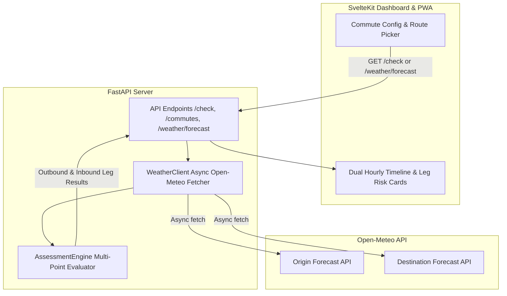

# Design Specification: Milestone v1.4 (Phase 15 - Multi-Route & Destination Weather)

## 1. Overview & Objectives
Milestone v1.4 introduces **Multi-Route & Destination Weather Evaluation** for Commute Check. Currently, safety checks evaluate weather at a single location (origin) for a single departure time. Real-world motorcycle commutes involve traveling between an origin (home) and a destination (workplace/school) at two distinct times of day (morning outbound and evening return).

This milestone enables:
1. **Dual Location Coordinates**: Support for separate Origin (`lat`, `lon`) and Destination (`dest_lat`, `dest_lon`, `dest_name`) coordinates.
2. **Outbound & Return Split Schedules**: Independent evaluation of morning outbound commute (`schedule_time`) and evening return commute (`return_schedule_time`).
3. **Leg-by-Leg & Combined Risk Assessment Engine**: Multi-point weather fetching and safety scoring for Outbound, Inbound, and Overall Route Go/No-Go decisions.
4. **Enhanced SvelteKit Route Visualizer**: UI controls to toggle between Outbound and Return forecasts, side-by-side origin vs. destination weather stats, and route leg risk summary cards.

---

## 2. Architecture & Data Flow



---

## 3. Data Models & Database Schema

### `app/models.py` Updates
Extend `CommuteBase` / `Commute` SQLModel schema:

```python
class CommuteBase(SQLModel):
    name: str = "Default Commute"
    lat: float
    lon: float
    # Destination support (optional)
    dest_name: Optional[str] = None
    dest_lat: Optional[float] = None
    dest_lon: Optional[float] = None
    
    schedule_time: str  # Outbound HH:MM
    return_schedule_time: Optional[str] = "17:00"  # Inbound HH:MM
    days_of_week: str = "mon-fri"
    
    webhook_url: Optional[str] = None
    min_temp_caution: float = 45.0
    min_temp_no_go: float = 38.0
    max_wind_caution: float = 15.0
    max_wind_no_go: float = 25.0
    rain_threshold: float = 30.0
    unit_system: UnitSystem = UnitSystem.IMPERIAL
```

### New Assessment Models (`app/models.py` / `app/weather/schemas.py`)
```python
class LegAssessment(BaseModel):
    leg_type: str  # "outbound" or "return"
    location_name: str
    schedule_time: str
    status: Status
    score: int
    reasons: List[str]
    weather: HourlyWeather

class RouteAssessmentResult(BaseModel):
    overall_status: Status
    overall_score: int
    outbound_leg: LegAssessment
    return_leg: Optional[LegAssessment] = None
    recommendation: str
```

---

## 4. Backend Components & Logic

### 4.1 `WeatherClient` (`app/client.py`)
- Update `fetch_weather(lat, lon)` or add `fetch_route_weather(origin_lat, origin_lon, dest_lat, dest_lon)` to fetch weather for both locations in parallel using `asyncio.gather()`.
- Utilize TTLCache for origin and destination forecasts independently.

### 4.2 `AssessmentEngine` (`app/engine.py`)
- Implement `assess_route(origin_weather, dest_weather, return_origin_weather, return_dest_weather, commute_config)`.
- **Outbound Score**: Min score between origin weather at departure time and destination weather at expected arrival time (or departure time).
- **Return Score**: Min score between destination weather at return time and origin weather at return arrival time.
- **Overall Status**: `NO_GO` if either outbound or return leg is `NO_GO`, `CAUTION` if either is `CAUTION`, else `GO`.

### 4.3 API Endpoints
1. `GET /weather/forecast`:
   - Query params: `lat`, `lon`, optional `dest_lat`, `dest_lon`.
   - Returns timeline for origin and destination if provided.
2. `POST /check`:
   - Evaluates full route assessment using the enhanced `AssessmentEngine`.
3. `PUT /commutes/{commute_id}` & `POST /commutes`:
   - Accepts updated fields: `dest_name`, `dest_lat`, `dest_lon`, `return_schedule_time`.

---

## 5. Frontend Dashboard & Visualization (`frontend/`)

1. **Commute Configuration Form**:
   - Add Destination toggle & location inputs (`dest_name`, `dest_lat`, `dest_lon`).
   - Add Return Schedule Time picker (`return_schedule_time`).
2. **Dashboard Overview**:
   - Display side-by-side Outbound (Morning) vs Return (Evening) leg summary cards.
   - Show overall Go/Caution/No-Go status pill and individual leg risk breakdown.
3. **Hourly Weather Chart**:
   - Tab / Toggle to switch between Origin Weather Timeline and Destination Weather Timeline, highlighting departure and return time windows.

---

## 6. Testing & Verification Strategy
1. **Unit Tests (`tests/test_engine.py`)**:
   - Test outbound leg evaluation (origin vs destination worse score wins).
   - Test return leg evaluation.
   - Test overall route status aggregation logic.
2. **API Tests (`tests/test_api.py`, `tests/test_weather_api.py`)**:
   - Test `/check` endpoint with origin-only and dual-location commutes.
   - Test `/weather/forecast` with `dest_lat` and `dest_lon`.
   - Test commute CRUD with destination fields.
3. **Frontend Tests (`frontend/src/`)**:
   - Vitest component tests for destination inputs, leg risk cards, and dual timeline rendering.

---

## 7. Migration & Backward Compatibility
- All new database fields (`dest_name`, `dest_lat`, `dest_lon`, `return_schedule_time`) are optional with sensible defaults.
- Single-location commutes continue to function seamlessly without destination coordinates set.
